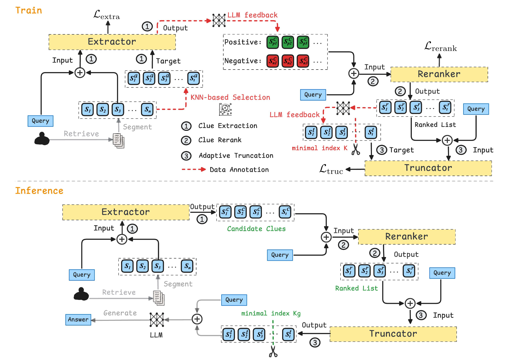

# Architecture




This is the repository for the paper: **Less is More: Compact Clue Selection for Efficient Retrieval-Augmented Generation Reasoning**.


# Updates

- 🎉 2026-01-13: CompSelect is accepted to the ACM Web Conference 2026 (WWW 2026)!

- 🚀 2025-10-23: Release of our initial codes.

# Installation
```shell
pip install -r requirements.txt
```

# Retriever Setup


For the retriever setup, please refer to [Self-RAG](https://github.com/AkariAsai/self-rag#:~:text=at%20Inference.-,Retriever%20Setup,-By%20default%2C%20we). We retrieve Top-60 documents as Full Content for each query.


# Training

We provide three modules for training:

- **Clue Extractor** and **Adaptive Truncator** are trained using **SFT fine-tuning** with [LLaMA-Factory](https://github.com/hiyouga/LLaMA-Factory).  
  Simply prepare instruction-style data and run:
```bash
llamafactory-cli train examples/train_lora/llama3_lora_sft.yaml
llamafactory-cli export examples/merge_lora/llama3_lora_sft.yaml
```

- Run the reranker training script:

```shell
python reranker/train_rerank.py \
  --data_path "$DATA_PATH" \
  --model_name "$MODEL_PATH" \
  --output_dir "$OUTPUT_DIR" \
  --train_batch_size $BATCH_SIZE \
  --max_seq_length $MAX_SEQ_LENGTH \
  --pooling $POOLING \
  --epochs $EPOCHS \
  --warmup_steps $WARMUP_STEPS \
  --lr $LR \
  --checkpoint_save_total_limit $CHECKPOINT_LIMIT \
  --eval_steps $EVAL_STEPS \
  --max_train_samples $MAX_TRAIN_SAMPLES

```

# Evaluation

We adopt Substring Exact Match (SubEM) and F1 for evaluation. SubEM checks whether the gold answer appears as a substring in the prediction, while F1 measures token-level overlap with the reference. 
```shell
python inference_llama.py 
    --input "$INPUT_FILE"   \
    --model "$MODEL"  
```

# Citation

If you feel this project is helpful, please consider cite our report 😊.

```
@inproceedings{zhang-compselect-2026,
author = {Zhang, Qianchi and Zhang, Hainan and Pang, Liang and Tong, Yongxin and Zheng, Hongwei and Zheng, Zhiming},
title = {Less is More: Compact Clue Selection for Efficient Retrieval-Augmented Generation Reasoning},
year = {2026},
isbn = {9798400723070},
publisher = {Association for Computing Machinery},
address = {New York, NY, USA},
url = {https://doi.org/10.1145/3774904.3792158},
doi = {10.1145/3774904.3792158},
booktitle = {Proceedings of the ACM Web Conference 2026},
pages = {1971–1982},
numpages = {12},
keywords = {retrieval-augmented generation, large language models, information retrieval},
location = {United Arab Emirates},
series = {WWW '26}
}

```